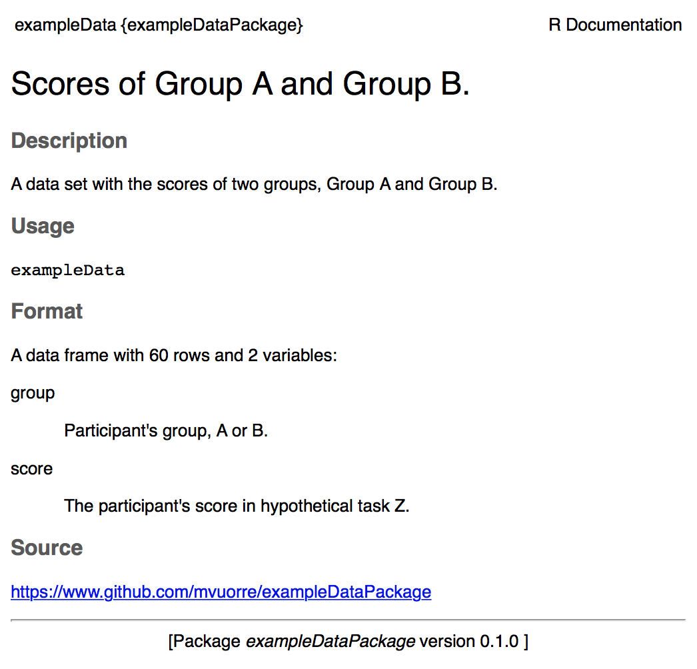

-   [exampleDataPackage](#exampledatapackage)
    -   [How to download the raw data manually](#how-to-download-the-raw-data-manually)
    -   [How to obtain the data from within R](#how-to-obtain-the-data-from-within-r)
-   [How to Create an R Data Package](#how-to-create-an-r-data-package)
    -   [Create a new R package with R Studio](#create-a-new-r-package-with-r-studio)
    -   [Describe the package](#describe-the-package)
    -   [Add Data](#add-data)
    -   [Document the data](#document-the-data)
-   [Advanced (optional) steps](#advanced-optional-steps)
    -   [Sharing the data product](#sharing-the-data-product)
    -   [Documenting analysis as vignette](#documenting-analysis-as-vignette)
    -   [Creating a website for the R data package](#creating-a-website-for-the-r-data-package)
-   [Further Reading](#further-reading)
    -   [Online Resources](#online-resources)
    -   [References](#references)

<!-- README.md is generated from README.Rmd. Please edit that file -->
exampleDataPackage
==================

This is the Git(Hub) repository of an example data package. In [our manuscript](https://github.com/mvuorre/reproguide-dataproduct), we describe why and how researchers might choose to share their data as R data packages. This repository is the example used in the manuscript, and can be inspected for details of the implementation.

How to download the raw data manually
-------------------------------------

The "raw data" used here is simulated for this particular example for illustration purposes.

You will find all the raw data as .csv files in the [`data-raw/`](https://github.com/mvuorre/exampleDataPackage/tree/master/data-raw) folder, from where they can be downloaded. That folder also contains full pre-processing instructions in the form of an R script.

How to obtain the data from within R
------------------------------------

One major benefit of wrapping the data into an R data package is its easy availability from within R. No more wasted time looking around the computer's hard drive for the correct data files!

Because the exampleDataPackage is hosted on GitHub, you can easily download it from within R:

``` r
# install.packages("devtools")  # Install this package if necessary
devtools::install_github("mvuorre/exampleDataPackage")
```

After the package finished installing (a few seconds), you can make the data in the package available in an R session:

``` r
library(exampleDataPackage)
head(exampleData)
#>   group     score
#> 1     a  97.18260
#> 2     a  86.87440
#> 3     a 107.95184
#> 4     a 102.70070
#> 5     a  97.22694
#> 6     a  94.33976
```

The rest of this README file describes briefly how to create R data packages. For more in-depth instructions, please refer to our [manuscript](https://github.com/mvuorre/reproguide-dataproduct). In writing this online tutorial, we relied heavily on Hadley Wickham's "R Packages", which is an excellent source of information on creating R packages (Wickham 2015).

How to Create an R Data Package
===============================

If you have not yet collected your data (*you need data for a data package*), it is a good idea to set up the package, as described here and in the [manuscript](https://github.com/mvuorre/reproguide-dataproduct), before any data is collected. Then, whenever new data arrives, you can place it in the correct folder and update the data package. Alternatively, if you already have data, you can create the data package and move all the data into the correct folder when required.

You will need one R package (R developer tools) to follow these instructions:

``` r
install.packages("devtools")
```

The **devtools** package (Wickham and Chang 2017) contains helpful functions for creating the R data package.

Create a new R package with R Studio
------------------------------------

First, use R Studio to create a new R Project. While creating the project, make sure to create the project as an R Package:


Creating an R (Package) Project with R Studio sets up the necessary infrastructure leaving little work for the user. After creating the package, the project's files and folders look like this:

``` bash
exampleDataPackage/
    |-- man/
    |-- R/
    DESCRIPTION
    NAMESPACE
    exampleDataPackage.Rproj
    .gitignore
    .Rbuildignore
```

`man/` is the "manuals" folder which will have files documenting the package. `R/` is a folder for any R function files. `DESCRIPTION` is a file describing the package, and `NAMESPACE` its functions. `exampleDataPackage.Rproj` identifies the folder as an R package. `.gitignore` and `.Rbuildignore` are hidden files, and specify which files should be ignored for Git operations, and R package building operations, respectively. The last three files can be safely ignored.

At this point, you can delete `man/hello.Rd` and `R/hello.R`. These two files are examples of R function files and R documentation files.

This is already a fully functional R package (although it contains nothing so it's pretty useless.) We now need to make a few changes to turn it into an R data package. In short, we will create a minimal data package.

1.  Describe the package
    -   DESCRIPTION and README files
2.  Add the data in appropriate locations
    -   Raw data, preprocessing scripts, R data object
3.  Document the data and package

After these three simple steps, you will have a reproducible data package on your computer. It will be easy for you to use from within R (or otherwise), and because it is documented you will never forget what was done and how.

We will also go through advanced (optional) steps.

1.  Sharing the package
    -   Upload it to GitHub so it is easily available to anyone (R user or otherwise)
    -   Mint a DOI for citeability and longevity (todo)
    -   Connect to Open Science Framework (todo)
2.  Document data analysis as package vignette
    -   Creates a readable .html file showing how the data is (or could be) analyzed
3.  Create a website for the data package
    -   Showcase your data and analysis online with a beautiful (and easy to create) website

Describe the package
--------------------

The `DESCRIPTION` file includes crucial information about the package in standard format. When you create an R package with R Studio, the process automatically creates this file with example content:

``` bash
Package: exampleDataPackage
Type: Package
Title: What the Package Does (Title Case)
Version: 0.1.0
Author: Who wrote it
Maintainer: The package maintainer <yourself@somewhere.net>
Description: More about what it does (maybe more than one line)
    Use four spaces when indenting paragraphs within the Description.
License: What license is it under?
Encoding: UTF-8
LazyData: true
```

Modify this file to something like the following (note you only need to change a few lines):

``` bash
Package: exampleDataPackage
Type: Package
Title: An example R data package
Version: 0.1.0
Authors@R: person("Matti", "Vuorre", email = "mv2521@columbia.edu",
                  role = c("aut", "cre"))
Maintainer: Matti Vuorre <mv2521@columbia.edu>
Description: This package is a minimal example of an R data package.
License: What license is it under?
Depends: R (>= 3.1.0)
Encoding: UTF-8
LazyData: true
```

The important changes to the above were the package's name, title, authors maintainer, description, and depends. Note the odd formatting for the `Authors@R` field; this ensures that the author's information is correctly recorded within the package. Then, you can go ahead and delete the `NAMESPACE` file. To add a license, it is easiest to use a helper function from the devtools package:

``` r
library(devtools)
use_mit_license()
```

The above function will automatically add the necessary MIT license file and update the license field in the `DESCRIPTION` file. Alternatively, you can use the GPL3 license with `use_gpl3_license()`.

Then, you'll want to add a `README` file which describes the package in some detail. We recommend writing the file in Markdown[1] or R Markdown (Allaire et al. 2016). Here, we choose to create a `README.Rmd` R Markdown file, which, when knitted, produces a nice looking `README.md` Markdown file. Using devtools:

``` r
use_readme_rmd()
```

You can then write a description of the package (what is it, why does it exist, who created it, who to contact, etc.) Make changes to `README.Rmd` with R Studio's text editor. When you are done, click Knit in R Studio.

Add Data
--------

First, we will add the raw data to its appropriate location (a `data-raw/` folder inside the project). You should use this helper function from devtools to create the folder, so that it is also appropriately handled when R builds the package:

``` r
use_data_raw()
```

You can then put all the raw data files to `data-raw/`. For this exampleDataPackage, we simulated some simple example data, and therefore also put the R script that simulated the data and created the data files in the same folder.

Then, move (or create) any pre-processing scripts or instructions to the same `data-raw/` folder. Doing so will allow for exact reproduction of the final data set. The pre-processing should output two files: One an easily downloadable .csv file, and also an R data object. To create the R data object, include the following at the end of your pre-processing script (or run in the console once you have completed pre-processing):

``` r
use_data(exampleData)
```

The above command assumes that your preprocessing results in an R data object called exampleData; you can change it to whatever you'd like. The `use_data()` function will save the R data object into `data/`. This means that your R package now includes a data set called `exampleData`.

Document the data
-----------------

R users are familiar with reading function documentation by typing `?mean` in the R console. That reveals the documentation page for the `mean()` function. By adding a documentation file, your data object will also have a documentation page, which is easily accessible from within R.

To document your data set, create a file called `data.R` in the `R` folder. Then, use the (roxygen2 (Wickham, Danenberg, and Eugster 2017)) documentation syntax to write your data object's documentation in the `R/data.R` file. It will look something like the following for our `exampleData` object:

``` r
#' Scores of Group A and Group B.
#'
#' @description A data set with the scores of two groups, Group A and Group B.
#'     The data were simulated to illustrate how to create R data packages.
#'
#' @format A data.frame with 60 rows and 2 variables:
#' \describe{
#'   \item{group}{Participant's group, A or B.}
#'   \item{score}{Participant's score in hypothetical task Z.}
#' }
#' @source \url{https://www.github.com/mvuorre/exampleDataPackage}
"exampleData"
```

The key features of this documentation file are (from top to bottom in the above code listing):

Each line begins with a `#'`. The first line is a short description of the data. The `@description` field is a longer description of the data (with indentation if it spans multiple lines). The `@format` field describes the object's type (e.g. an R data.frame), its dimensions, and then describes all the variables (e.g. `group` and `score`). Importantly, the `@source` field includes the source of the data, which could be a citation to an academic article, for example. Finally, the last line should be the name of the data object in quotation marks. You can document multiple data files in the same `R/data.R` file; simply leave one blank line between them.

It is important to document data well and precisely so there is never any ambiguity in the meaning of variables, where the data is from, etc. You should therefore spend some time writing this documentation file. Once the package has been built, this documentation can be viewed in R by calling (for this example data called `exampleData`) `?exampleData`:



Once you are done writing your description, you can use the `document()` helper function:

``` r
document()
```

This function, from the devtools package, will take what you have written and creates the necessary files in the `man/` folder.

Then go to R Studio's **Build** tab, and click "Build & Reload". If everything went well, this should build the R package you have just created, and loads it into your current R workspace. You can then use your data simply by calling the name of the data object:

``` r
head(exampleData)
#>   group     score
#> 1     a  97.18260
#> 2     a  86.87440
#> 3     a 107.95184
#> 4     a 102.70070
#> 5     a  97.22694
#> 6     a  94.33976
```

Of course, if you just wanted to use your own data right now, there is little point in doing the extra work described here. However, the true benefits become apparent when you want to come back to the data in a few months time. It will be available to you with the above command, with full documentation. Furthermore, the data product is now easily shared with others, as described next.

Advanced (optional) steps
=========================

Sharing the data product
------------------------

The easiest way to share the data product is to create the R package as a Git repository (see our tutorial on Git + GitHub: <https://github.com/mvuorre/reproguide-curate> (Vuorre and Curley 2017)) and share it on GitHub. Once the R package's source code is pushed to GitHub, authorized users (by default, anyone) can browse it on GitHub and manually download any files they'd like (e.g. the raw data files.) Importantly, they can obtain the data very easily from within R by installing the R package you have just created:

``` r
devtools::install_github("mvuorre/exampleDataPackage")
```

The above command, when executed in R, downloads and installs the `exampleDataPackage` from GitHub user `mvuorre`. You can view this example data package on GitHub: <https://github.com/mvuorre/exampleDataPackage>.

Documenting analysis as vignette
--------------------------------

It is also helpful to share the full analysis code in which the data was used. We recommend writing analyses with R Markdown. R Markdown files can easily be turned into an *R package vignette*. To initiate a vignette, use

``` r
devtools::use_vignette("Example-Analysis")
```

This creates a vignette template into the `vignettes/` folder. Write your analysis into the `.Rmd` file. See `vignettes/Example-Analysis.Rmd` for an example. Writing your analysis into a vignette ensures that users of the data also have access to the original analysis of the data. Furthermore, vignettes can be built into the package's website.

Creating a website for the R data package
-----------------------------------------

You can even create a website for the data package. For this, you need the [pkgdown](https://hadley.github.io/pkgdown/) R package (Wickham 2017):

``` r
# install.packages("devtools")
devtools::install_github("hadley/pkgdown")
```

Then, to build your package's website, you will need to edit the first few lines of the `README.Rmd` file, from

    output:
      md_document:
        variant: markdown_github

to

    output: rmarkdown::github_document

We expect that in future releases of devtools will eliminate the need for manually changing this.

After you've edited `README.Rmd`, Knit it once more. Then, to create the website, simply run:

``` r
pkgdown::build_site()
```

The website is now available at `docs/index.html`. You can open it and view it locally. However, you will certainly want to upload the website somewhere so that others can access it too.

To make the website available to others, you can host it somewhere in the internet. The easiest option, again, is to host it on GitHub.

Assuming you have created the package in a local Git repository and have synced the repository to GitHub, this is easy. Push all the current changes to GitHub, and then go to the package's GitHub website, click "Settings", and scroll down to "GitHub Pages". There, click on the "Source" pull-down menu that currently says "None", and choose the "master branch /docs folder". Save the changes. After a little while, the page will be visible at <https://username.github.io/packagename>. For example, `exampleDataPackage`'s website is at <https://mvuorre.github.io/exampleDataPackage>.

Thank you for reading.

Further Reading
===============

Online Resources
----------------

-   <http://r-pkgs.had.co.nz/>: Website of Hadley Wickham's R Packages book
-   [Writing an R package from scratch](https://hilaryparker.com/2014/04/29/writing-an-r-package-from-scratch/): A short and good blog post on how to create minimal R packages
-   [Writing R Extensions](https://cran.r-project.org/doc/manuals/r-release/R-exts.html): The official R documentation on writing R packages. This is the complete and definitive set of instructions on how to write R packages. It is almost unreadable in it's comprehensiveness, and unnecessary for small R packages such as the data package described here.

References
----------

Allaire, J. J., Joe Cheng, Yihui Xie, Jonathan McPherson, Winston Chang, Jeff Allen, Hadley Wickham, and Rob Hyndman. 2016. *Rmarkdown: Dynamic Documents for R* (version 1.3). <https://cran.r-project.org/web/packages/rmarkdown/index.html>.

Vuorre, Matti, and James P. Curley. 2017. “Curating Research Assets in Behavioral Sciences: A Tutorial on the Git Version Control System.” *PsyArXiv Preprints*, June. doi:[10.17605/OSF.IO/TXGN8](https://doi.org/10.17605/OSF.IO/TXGN8).

Wickham, Hadley. 2015. *R Packages: Organize, Test, Document, and Share Your Code*. “O’Reilly Media, Inc.” <http://r-pkgs.had.co.nz/>.

———. 2017. *Pkgdown: Make Static HTML Documentation for a Package*. <https://github.com/hadley/pkgdown>.

Wickham, Hadley, and Winston Chang. 2017. *Devtools: Tools to Make Developing R Packages Easier*. <https://CRAN.R-project.org/package=devtools>.

Wickham, Hadley, Peter Danenberg, and Manuel Eugster. 2017. *Roxygen2: In-Line Documentation for R*. <https://CRAN.R-project.org/package=roxygen2>.

[1] <https://daringfireball.net/projects/markdown/>
